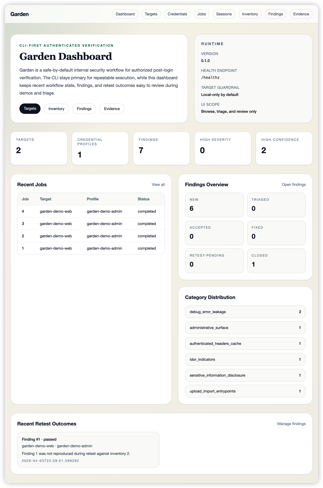

# Garden

Garden 是一个 **CLI-first、minimal-Web-UI-second** 的安全工作流工具，面向**授权场景下的登录后应用面验证**。

## 界面预览



## DVWA 实战展示

下面这组截图来自一次真实的 DVWA 登录后验证流程，展示的是 Garden 在受控靶场中的典型输出，而不是匿名扫描结果。

- 登录方式：Playwright UI login
- 目标类型：授权的本地 DVWA 靶场
- 展示重点：登录后 inventory、低风险 findings、redacted evidence

DVWA findings 示例：


DVWA evidence 示例：


## Problem（问题）

企业 AppSec 团队、内部安全测试团队在真实工作中经常会遇到一个很典型的断层：

- 匿名扫描器进不去登录后的业务系统
- 手工登录后测试很难复用、量化和持续执行
- inventory、finding、evidence、retest、export 往往散落在不同工具里
- “录一段流量、记几条笔记”并不能形成可审阅、可复测、可交付的工作流产物

Garden 的目标，就是补上这条断层，但**不**把自己做成 exploit framework、破坏性测试平台或者公网扫描器。

## Users（用户）

Garden 主要面向这些用户：

- Application Security（AppSec）团队
- 内部安全测试 / 授权渗透测试团队
- 搭建内部验证流程的 Security Engineering 团队
- 需要 review findings 与 evidence 的开发或系统负责人
- 需要演示流程成熟度、平台设计能力或工程思路的安全负责人 / 面试候选人

## Workflow（工作流）

Garden 当前支持的主工作流是：

`target -> credential profile -> login -> authenticated session -> inventory -> checks -> findings -> evidence -> triage -> retest -> export`

目前这条链路已经落地为：

- 管理 target，包含 owner、tags、status 和默认安全 guardrail
- 管理 credential profile，保存 `secret_ref` 而不是原始 secret
- 通过 HTTP / Playwright login adapter 执行登录
- 保存可复用的 authenticated session
- 对 session 做 validate / refresh
- 构建结构化的 authenticated inventory
- 记录 page、endpoint、parameter、annotation，而不是只保存流量 blob
- 在 inventory 上执行低风险、可解释的 checks
- 生成带 severity / confidence 的 findings
- 为 findings 关联默认脱敏的 evidence
- 支持 findings 生命周期状态流转
- 支持 retest
- 支持 findings/report 导出

Garden 为什么坚持 **CLI 是主入口**：

- 真实用户主要在终端、脚本、CI/CD、远端服务器里工作
- CLI 更适合批量执行、自动化和复现
- 这样它更像一个真实的安全工程工具，而不是一个只能点点点的 demo

Garden 为什么坚持 **Web UI 只是轻量辅助**：

- Web UI 主要服务于 browse、triage、review、demo
- 不负责承载核心业务逻辑
- 不做重前端，不做 SPA，不把项目带偏成“前端产品”

### CLI 命令总览

Garden 的主命令是：

```bash
gardenctl
```

最常用的全局命令：

| 命令 | 用途 |
| --- | --- |
| `gardenctl --help` | 查看全部命令与帮助信息 |
| `gardenctl version` | 查看当前版本 |
| `gardenctl healthcheck` | 不启动 Web 服务，直接做本地健康检查 |

Target 管理：

| 命令 | 用途 |
| --- | --- |
| `gardenctl target add` | 新增一个 target |
| `gardenctl target list` | 列出全部 target |
| `gardenctl target show <id>` | 查看某个 target 详情 |
| `gardenctl target delete <id> --yes` | 删除 target |
| `gardenctl target import --file <path>` | 从 YAML / JSON 导入 target |

Credential Profile 管理：

| 命令 | 用途 |
| --- | --- |
| `gardenctl cred add` | 新增 credential profile |
| `gardenctl cred list` | 列出全部 credential profile |
| `gardenctl cred show <id>` | 查看某个 credential profile |
| `gardenctl cred delete <id> --yes` | 删除 credential profile |

Job 浏览：

| 命令 | 用途 |
| --- | --- |
| `gardenctl job list` | 查看 workflow 过程中产生的 jobs |
| `gardenctl job show <id>` | 查看某个 job 的详情与摘要 |

登录与 Session：

| 命令 | 用途 |
| --- | --- |
| `gardenctl login test --target <name> --profile <name>` | 执行登录测试并在成功时创建可复用 session |
| `gardenctl login validate --session <id>` | 校验已有 session 是否仍然有效 |
| `gardenctl session list` | 列出已保存 session |
| `gardenctl session show <id>` | 查看某个 session 的红acted元数据 |
| `gardenctl session refresh <id>` | 刷新某个 session |

Authenticated Inventory：

| 命令 | 用途 |
| --- | --- |
| `gardenctl inventory build --target <name> --profile <name>` | 先 fresh login，再构建一轮 inventory |
| `gardenctl inventory build --session <id>` | 复用已有 session 构建 inventory |
| `gardenctl inventory list` | 列出全部 inventory runs |
| `gardenctl inventory show <id>` | 查看某个 inventory run 的页面、接口、参数、annotation 摘要 |
| `gardenctl inventory export --id <id> --format json` | 导出 inventory 为 JSON |
| `gardenctl inventory export --id <id> --format csv` | 导出 inventory 为 CSV |

Checks：

| 命令 | 用途 |
| --- | --- |
| `gardenctl checks run --inventory <id>` | 对某个 inventory run 执行内置低风险 checks |

Findings：

| 命令 | 用途 |
| --- | --- |
| `gardenctl findings list` | 列出全部 findings |
| `gardenctl findings list --status <status>` | 按生命周期状态过滤 findings |
| `gardenctl findings list --category <category>` | 按检查类别过滤 findings |
| `gardenctl findings show <id>` | 查看 finding 详情、inventory refs、evidence refs、retest 信息 |
| `gardenctl findings update-status <id> --status <status>` | 更新 finding 生命周期状态 |
| `gardenctl findings export --format md` | 导出 findings Markdown |
| `gardenctl findings export --format json` | 导出 findings JSON |
| `gardenctl findings export --format csv` | 导出 findings CSV |

Evidence：

| 命令 | 用途 |
| --- | --- |
| `gardenctl evidence list` | 列出全部 evidence |
| `gardenctl evidence list --finding <id>` | 只看某个 finding 的 evidence |
| `gardenctl evidence show <id>` | 查看 evidence 元数据与默认脱敏 preview |
| `gardenctl evidence export --finding <id> --format json` | 导出某个 finding 的 evidence 为 JSON |
| `gardenctl evidence export --finding <id> --format md` | 导出某个 finding 的 evidence 为 Markdown |

Retest 与 Report：

| 命令 | 用途 |
| --- | --- |
| `gardenctl retest run --finding <id>` | 对 `fixed` 或 `retest-pending` finding 执行复测 |
| `gardenctl report generate --job <id> --format md` | 为某个 job 生成 Markdown report |

### 推荐使用顺序

如果你第一次使用 Garden，建议按下面这个顺序走：

1. `gardenctl healthcheck`
2. `gardenctl target add` 或 `gardenctl target import`
3. `gardenctl cred add`
4. `gardenctl login test`
5. `gardenctl inventory build`
6. `gardenctl checks run`
7. `gardenctl findings list`
8. `gardenctl evidence list`
9. `gardenctl findings update-status`
10. `gardenctl retest run`
11. `gardenctl findings export` / `gardenctl report generate`

## Outputs（输出）

Garden 产出的不是“跑过了什么命令”或“一堆原始流量”，而是结构化工作流产物：

- target 清单
- credential profile 清单
- authenticated session 记录
- 审计事件（login / validate / refresh / status update / export / retest / report）
- scan jobs
- authenticated inventory runs
- page / endpoint / parameter / annotation 结构化数据
- explainable low-risk findings
- linked redacted evidence
- retest records
- findings Markdown / JSON / CSV 导出
- job Markdown report

也就是说，Garden 的价值不只是“做了扫描”，而是把登录后验证工作真正串成了一条可 review、可复测、可导出的流程。

## Non-goals（非目标）

Garden **不是**：

- 桌面 GUI 应用
- 通用匿名漏洞扫描器
- 公网扫描工具
- 破坏性测试平台
- exploit framework
- brute-force / fuzzing 引擎
- 恶意文件上传测试器
- Burp / ZAP 的替代品
- 单纯的 traffic recorder
- 只做 API auth testing 的工具

它不会假装要替代 Burp、ZAP、Nuclei、DefectDojo 或所有安全工具。  
它解决的是这些工具之间**没有自然串起来的登录后工作流问题**。

## Integration（与现有工具的关系）

Garden 的定位是补位，而不是全替代。

它**不是**“就是 Burp/ZAP”：

- Burp/ZAP 非常适合手工代理测试
- Garden 补的是登录编排、authenticated inventory、findings lifecycle、redacted evidence、retest/export

它**不是**“就是一个 recorder”：

- recorder 解决的是“录下来”
- Garden 解决的是“录下来之后如何形成 inventory、findings、evidence、retest-ready state”

它**不是**“就是一个 scanner wrapper”：

- 把别的扫描器包一层并不会自然得到工作流闭环
- Garden 的重点是结构化输出和流程完整性

它**不是**“就是 API auth testing”：

- 登录后验证不只有 API
- 还包括页面、会话、浏览器上下文、证据、复测和报告

## Constraints（约束）

Garden 刻意保持这些约束：

- CLI-first
- minimal server-rendered Web UI
- 默认只允许本地 / demo 目标
- 非本地目标必须显式放开
- 不做 destructive testing
- 不做 exploit execution
- 登录、inventory、checks、evidence、exports 默认都走保守路径
- secrets 不直接存储、不直接打印
- evidence 和 exports 默认脱敏
- inventory 必须结构化，不能退化成原始流量堆
- 核心逻辑必须在 service 层
- route handler / CLI 输出 / template 不承载核心业务逻辑

这些限制不是“暂时没做”，而是 Garden 产品身份的一部分。

## Why not just use existing tools（为什么不直接用现有工具）

因为“现有工具都很强”这件事，并不等于“这条工作流已经被解决了”。

Garden 的价值就在于：它不是单点能力，而是把这些能力串起来。

为什么它不是“只用 Burp/ZAP 就够了”：

- Burp/ZAP 更偏手工测试与代理分析
- Garden 更偏授权场景下的流程编排、结构化 inventory、workflow state 和 evidence lifecycle

为什么它不是“录流量就好了”：

- 录流量不等于结构化资产覆盖
- 录流量也不等于 explainable findings、默认脱敏 evidence、retest 或 export

为什么它不是“套壳调别的 scanner”：

- scanner wrapper 更容易得到一堆零散结果
- Garden 更强调可解释、可追踪、可复用的 workflow outputs

为什么它不是“只做 API 权限测试”：

- 真实企业系统的登录后面不只有 API
- 还有页面、管理面、配置页、导出页、import/upload 入口、浏览器态 evidence

## Metrics（衡量指标）

Garden 当前更关心“工作流是否成立”，而不是“扫出多少条结果”。

比较合理的成功指标包括：

- 本地 5 到 10 分钟能完整跑通 demo
- CLI 在 target / login / inventory / checks / findings / evidence / retest / report 上保持一致和清晰
- 输出是结构化、可关联、可理解的
- findings 不至于变成大量无意义噪声
- evidence 和 exports 默认安全、默认脱敏
- reviewer 能从 finding 一路看到 inventory context、evidence、status、retest 和 report
- 整个仓库看起来像一个真实的内部 AppSec MVP，而不是一次性 hackathon demo

## Demo（演示）

推荐的本地 demo 路径是：

1. 创建并激活虚拟环境
2. 安装依赖：`make install`
3. 复制 `.env.example` 为 `.env`
4. 启动应用：`make demo`
5. 验证：`curl -s http://127.0.0.1:8000/healthz`
6. 导入本地 target 示例：
   - [examples/targets/local-demo-targets.yaml](/Users/an/Documents/Garden/examples/targets/local-demo-targets.yaml)
7. 添加 credential profile，使用：
   - [examples/login/demo-http-admin.yaml](/Users/an/Documents/Garden/examples/login/demo-http-admin.yaml)
8. 测试登录：
   - `gardenctl login test --target <name> --profile <name>`
9. 构建 inventory：
   - `gardenctl inventory build --target <name> --profile <name>`
10. 跑 checks：
   - `gardenctl checks run --inventory <id>`
11. 查看 findings：
   - `gardenctl findings list`
   - `gardenctl findings show <id>`
12. 查看 evidence：
   - `gardenctl evidence list`
   - `gardenctl evidence show <id>`
13. 更新状态：
   - `gardenctl findings update-status <id> --status fixed`
14. 执行 retest：
   - `gardenctl retest run --finding <id>`
15. 导出结果：
   - `gardenctl findings export --format md`
   - `gardenctl findings export --format json`
   - `gardenctl findings export --format csv`
   - `gardenctl report generate --job <id> --format md`
16. 浏览页面：
   - `/`
   - `/targets`
   - `/jobs`
   - `/sessions`
   - `/inventory`
   - `/findings`
   - `/evidence`

### DVWA 示例

如果你想展示 Garden 对真实登录后靶场的工作流能力，可以用 DVWA 做一个简短、稳定的演示。

1. 启动 DVWA：
   - `docker run --rm -d --name dvwa -p 8081:80 vulnerables/web-dvwa`
2. 浏览器打开：
   - `http://127.0.0.1:8081/setup.php`
3. 点击 `Create / Reset Database`
4. 登录：
   - 用户名：`admin`
   - 密码：`password`
5. 进入 `DVWA Security`，把安全级别调成 `Low`
6. 在 Garden 终端里准备环境：
   - `export GARDEN_DATABASE_URL=sqlite+pysqlite:///./data/dvwa-test.db`
   - `export DVWA_ADMIN_PASSWORD=password`
7. 添加 target：
   - `gardenctl target add --name dvwa-local --base-url http://127.0.0.1:8081 --type web --owner appsec --tag demo --tag dvwa --tag local`
8. 添加 Playwright 登录 profile：
   - `gardenctl cred add --target-id 1 --name dvwa-admin-ui --role admin --auth-type password --username admin --secret-ref env://DVWA_ADMIN_PASSWORD --login-config-path examples/login/dvwa-playwright-admin.yaml`
9. 测试登录：
   - `gardenctl login test --target dvwa-local --profile dvwa-admin-ui`
10. 构建更聚焦的登录后 inventory：
   - `gardenctl inventory build --target dvwa-local --profile dvwa-admin-ui --include /index.php --include /security.php --include /vulnerabilities --include /phpinfo.php --exclude /setup.php --exclude /docs`
11. 运行 checks：
   - `gardenctl checks run --inventory <latest_inventory_id>`
12. 查看 findings / evidence：
   - `gardenctl findings list`
   - `gardenctl evidence list`

这条 DVWA 演示路径更适合说明 Garden 的几个核心卖点：

- 它不是匿名扫描，而是登录后应用面 workflow
- 它不会直接做 exploit，而是生成低风险、可解释的 findings
- 它能把 findings 和 redacted evidence 串起来
- 它更像一个内部 AppSec 工作流 MVP，而不是单点脚本

上面的 “DVWA 实战展示” 截图对应的就是一次真实的 Garden 运行结果。
